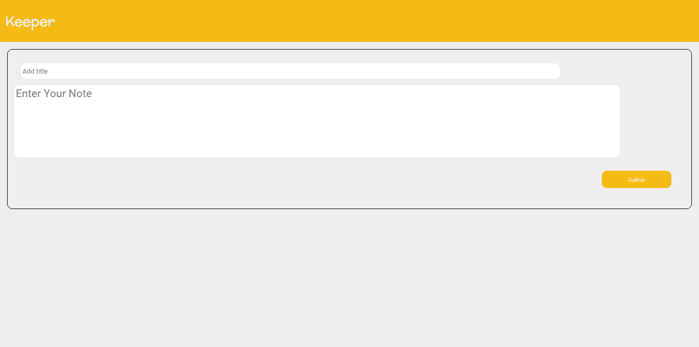
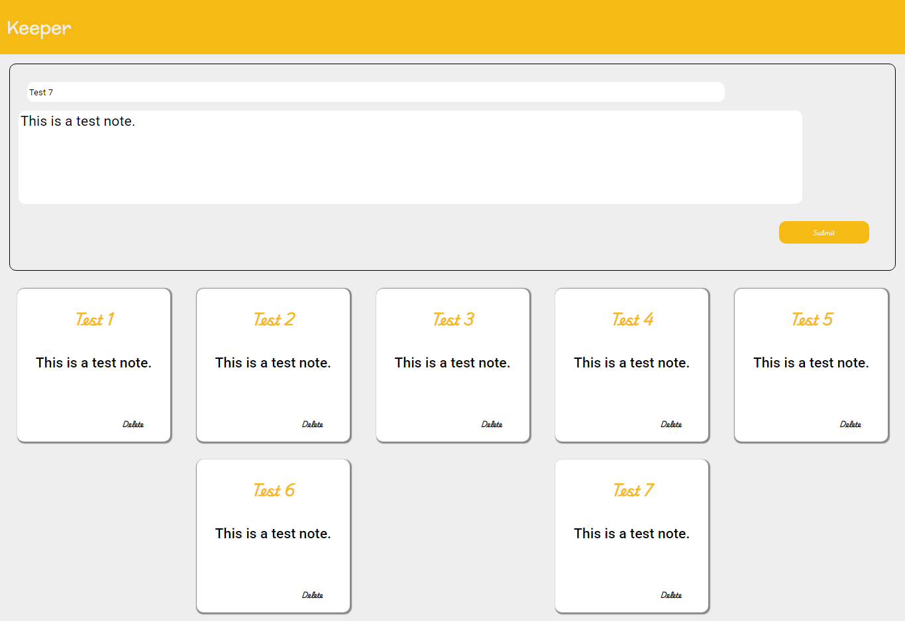
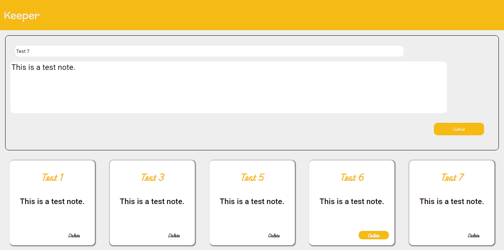

📝 Notes App
A simple and stylish React app that allows users to add, view, and delete notes. Built using functional components and React hooks for a clean, modern experience.

🚀 Features
📄 Add notes with a title and content

🗑️ Delete individual notes

🎨 Styled using CSS with custom fonts and colors

🔄 Dynamic rendering using React hooks (useState)

📦 Modular components: Nav, Input, Card

📂 Project Structure
graphql
Copy
Edit
src/
├── App.jsx        # Main app logic (state and rendering)
├── card.jsx       # Note card component with delete functionality
├── input.jsx      # Input form for adding new notes
├── navbar.jsx     # Navigation header
├── index.css      # Styling
📸 Screenshots (Optional)
Add a screenshot of your app here for better presentation:

md
Copy
Edit

🛠️ Technologies Used
React (Functional Components + Hooks)

CSS (Custom styling)

JavaScript (ES6+)

📦 Installation
1. Clone the repository
bash
Copy
Edit
git clone https://github.com/DiaaEldinHassan/Keeper.git
cd Keeper
2. Install dependencies
bash
Copy
Edit
npm install
3. Run the development server
bash
Copy
Edit
npm run dev     # If using Vite
# OR
npm start       # If using Create React App
🧪 Usage
Type a title and a note in the input form.

Click "Add" to create a new note card.

Click the Delete button on a card to remove it.

🎨 Styling Highlights
Color theme using CSS variables (--yellow, --whitish)

Clean layout using Flexbox (.wrapper, .card)

Responsive design for note cards

Font styling with Roboto and a cursive display font

🙋‍♂️ Author
DiaaEldinHassan

